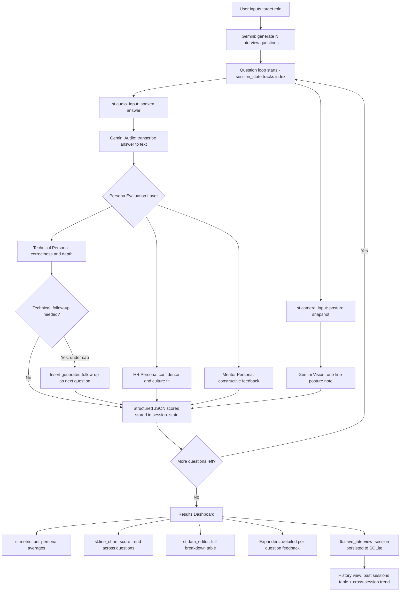

# System Design — Viva Panel Simulator

## Data Flow Diagram

## API Integration Strategy

**Why 3 separate Gemini calls instead of 1 combined prompt?**
Running personas as independent calls (rather than asking one prompt to "act as three
people") keeps each evaluation focused and avoids the model blending perspectives or
anchoring all three scores near each other. It costs more API calls but produces more
differentiated, realistic feedback — which is the core value proposition of the app.

**Why `st.form` around each answer submission?**
Camera and audio widgets re-render on every Streamlit interaction. Wrapping the final
submit action in `st.form` ensures the transcription + 3-persona evaluation pipeline
(4 API calls) only fires once per question, on explicit submit — not on every widget
touch.

**Why session_state instead of re-fetching per rerun?**
Streamlit reruns the whole script on every interaction. All interview progress
(current question index, all past answers, all past evaluations) lives in
`st.session_state` so a user can move through a multi-question interview and land on
a final dashboard that reflects the entire session, not just the last question.

**Why adaptive follow-ups are capped at 3 per session?**
Without a cap, a candidate who consistently gives shallow answers could theoretically
trigger an unbounded interview loop (every answer spawns another follow-up). The cap
keeps the session length predictable while still demonstrating genuinely adaptive
behavior — the app doesn't ask the same fixed question set every time.

**Why SQLite instead of a full auth + multi-user backend?**
This app has no login system — it's a single-user local/personal-deployment tool.
SQLite gives session history and trend-over-time value without the complexity of
user accounts, which isn't required by the project scope.

## Logic Modules

| Module | Responsibility |
|---|---|
| `prompts.py` | Builds all prompt strings — question generation + persona evaluation prompts, including the extended technical follow-up prompt |
| `gemini_client.py` | Isolates all Gemini API calls (text/audio/vision) via the `google-genai` SDK |
| `db.py` | SQLite read/write for interview history — no ORM, kept minimal |
| `app.py` | UI, session_state machine (`setup` → `interview` → `results`), history view, rendering |

## Known Limitations
- Audio transcription quality depends on Gemini's audio understanding for the given model version
- Posture analysis from a single photo is a rough proxy, not a rigorous biomechanics read
- History is stored locally in SQLite per deployment instance — it does not sync across devices or browser sessions, since there is no user auth layer
